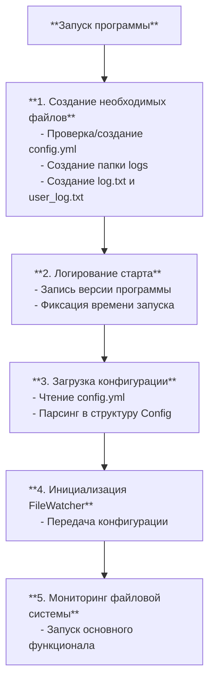

# 🚀 Блок-схема запуска программы

```mermaid
flowchart TB
    A["**Запуск программы**"] 

    A --> B["**1. Создание необходимых файлов**
    - Проверка/создание config.yml
    - Создание папки logs
    - Создание log.txt и user_log.txt"]
  

    B --> C["**2. Логирование старта**
    - Запись версии программы
    - Фиксация времени запуска"]
  

    C --> D["**3. Загрузка конфигурации**
    - Чтение config.yml
    - Парсинг в структуру Config"]
  

    D --> E["**4. Инициализация FileWatcher**
    - Передача конфигурации"]


    E --> F["**5. Мониторинг файловой системы**
    - Запуск основного функционала"]
  

    classDef default font-family:Helvetica,font-size:14px,text-align:left
```
